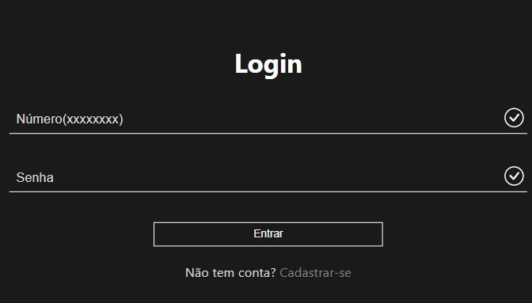
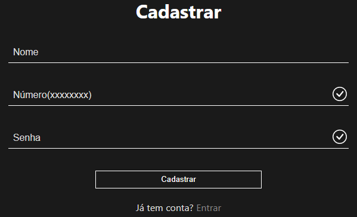
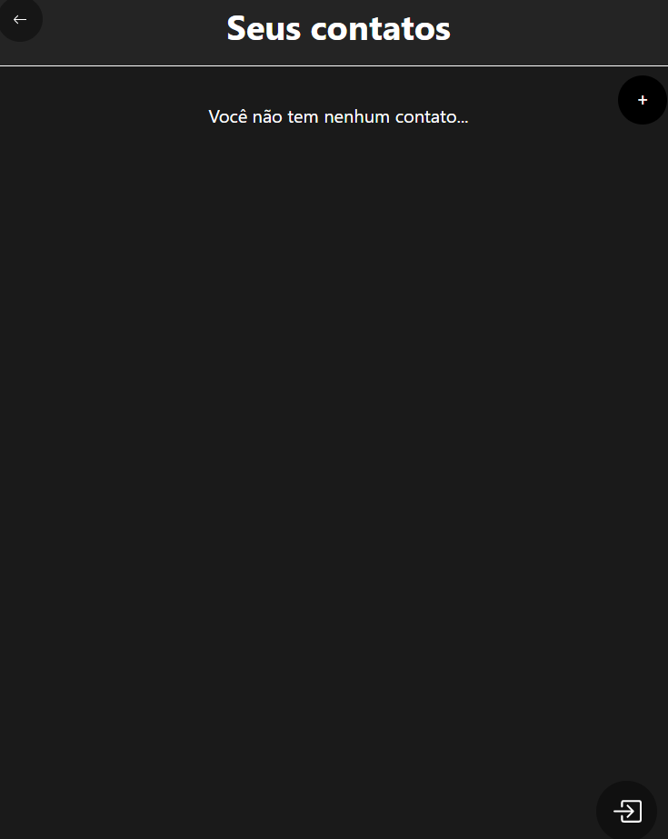
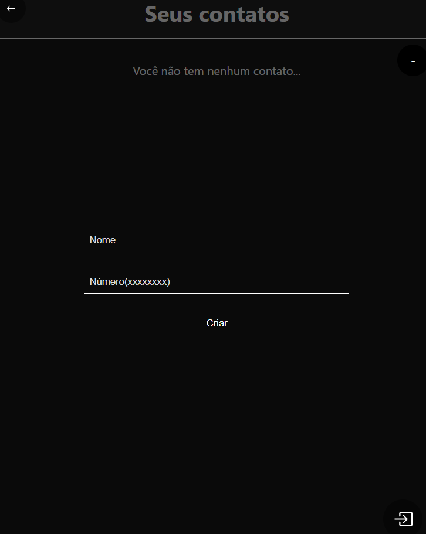
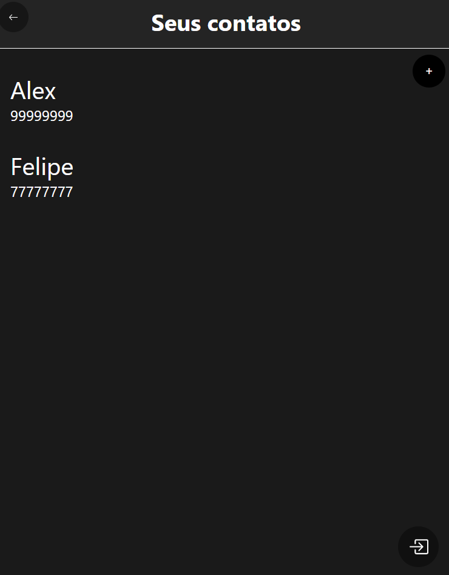
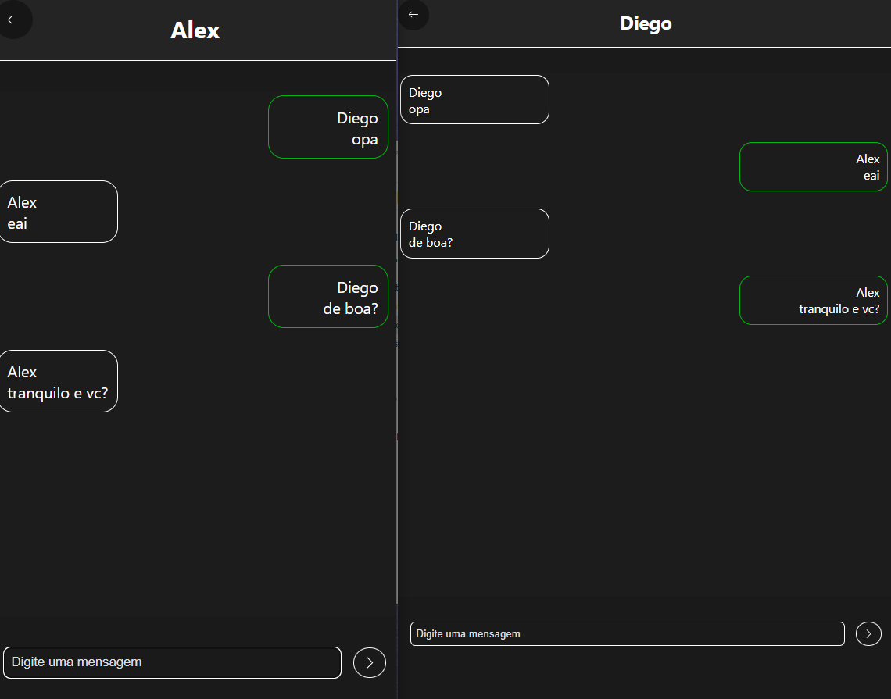
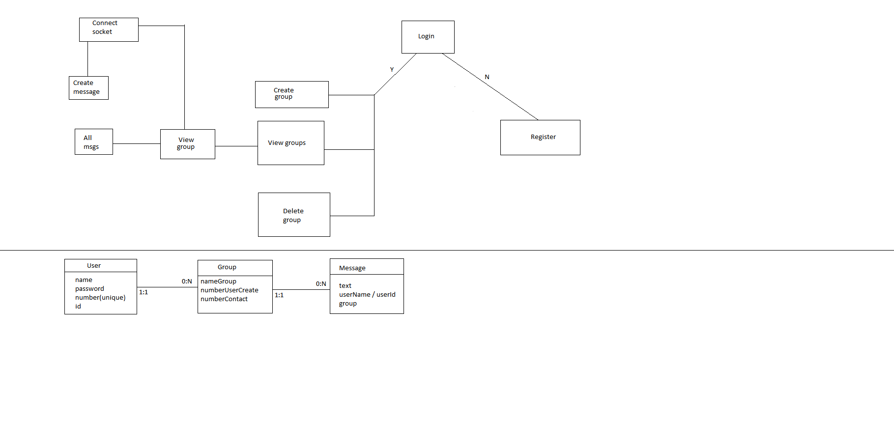
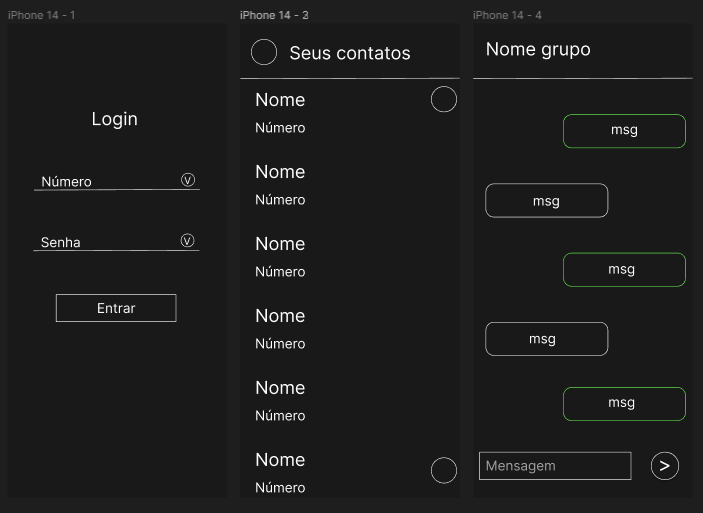

# Mini Chat

# Sobre o projeto
<p>O projeto consiste em uma aplicação de troca de mensagens em tempo real. Você pode criar um contato e ambos conversarem atráves do chat. O contato pode ser deletado tanto por quem o criou quanto pelo usuário adicionado. O projeto conta também com um sistema de autenticação.</p>

## Imagens do projeto
<div float="left">
    
    
    <br />
    
    
    
    <br />
    
</div>

## Modelo Back end


## Modelo Front end

<p><a href="https://www.figma.com/file/I7KTnC7h2GChDoB8ExUg9y/Untitled?node-id=0%3A1">Ver modelos</a> no Figma</p>

# Tecnologias utilizadas
## Back end
- Node.js
- MySQL / Sequelize
- JWT
- Socket

## Front end
- React
- Toolkit(gerenciamento de estados)
- Socket

# Como executar o projeto
```bash
# clonar repositório
git clone https://github.com/diegocruz-s/appChat
```
## Back end
```bash
# entrar no diretório backend
cd backend

# criar um arquivo .env e passar as inforomações de acordo com o arquivo .env.example
Necessário um banco de dados MySQL

# instalar as dependências
npm install

# rodar o back end
npm start
```

## Front end 
```bash
# entrar no diretório frontend
cd frontend

# instalar as dependências
npm install

# rodar o projeto
npm start
```

# Autor
<p>Diego Cruz's</p>
<a href="https://www.linkedin.com/in/diegoscruz/">https://www.linkedin.com/in/diegoscruz/</a>